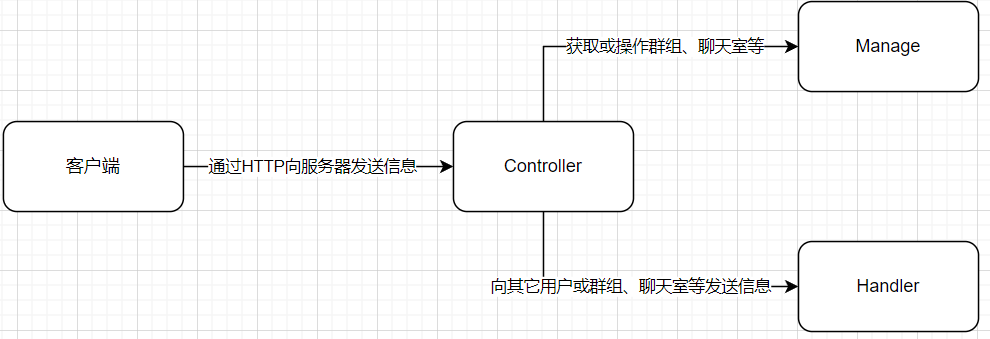

# 消息增强器单机版 - 学习手册

## 项目分类

```
message-plus               // 消息增强器单机版
message-plus-cluster       // 消息增强器集群版
message-plus-cluster-test  // 消息增强器集群版测试
message-plus-manage-system // 消息增强器管理系统
message-plus-test          // 消息增强器单机版测试
message-plus-website       // 消息增强器官网
```

## 项目包结构

```
cn.redcoral.messageplus
├── config        // 配置包
├── constant      // 常量包
├── controller    // 外部接口包
├── data          // 持久层模块
│     ├── dictionary     // 字典包
│     ├── entity         // 实体类包
│     │     ├──  message         // 消息类包
│     │     └──  po              // 数据库映射包
│     ├── mapper         // 数据访问层
│     └── service        // 业务逻辑层
├── handler       // 消息处理包
├── initialize    // 初始化包
├── interceptor   // 消息拦截器
├── manage        // 消息管理包
├── port          // 开发者接口包
├── properties    // 配置文件包
├── utils         // 工具包
│     ├── cache          // 缓存工具类
│     └── exterior       // 第三方工具包
└── EnableMessagePlus.java // 启动类注解
```

## 客户端接入服务端顺序（该连接方式用于服务器主动发送信息）


## 客户端发送顺序（该方式用于客户端主动获取信息）



## 配置文件详细内容

```yaml
messageplus:
  service-id: ID # 服务ID（单机版无用）
  token-expiration-time: 0 # Token过期时间（默认：0，单位：分钟）
  message:       # 消息配置
    concurrent-number: 1 # 消息并发数
    retry-count: 2       # 发送失败后重试次数
    intervalTime: 1000   # 每次重试间隔时间（单位：ms）
  chatroom:      # 聊天室配置
    survival-time: 120   # 消息存活时间（单位：s）
    message-max-size: 20 # 消息临时存储最大条数
```

## 开发者调用层级

```
controller ──> manage ──> service ──>mapper
                  └──────────└──> cacheUtil
```

若 manage层 中的方法既需要调用 cacheUtil层，也需要调用 service层。

则优先调用 service层，再由 service层 去调用 cacheUtil层。

## 版本开发流程

### 1、团队协作开发

### 2、测试Bug

保证全部功能正常，以及最基本的性能优化。

### 3、优化代码

消除或优化代码冗余

如：删除不必要的控制台输出、删除注释或废弃的代码块、优化臃肿或无意义的代码。

### 4、发布
